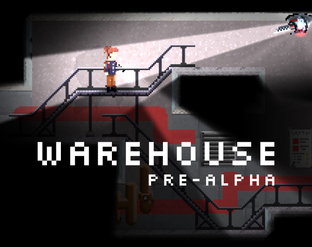

# **Warehouse** - Pre-Alpha release

## Submission to [Godot Wild Game Jam](https://godotwildjam.com/) #35

### By: Brady DeBoer and Nathan Hart
\

Warehouse is an exploratory platformer of an abandoned laboratory.

This game was made by Brady DeBoer and Nathan Hart for the Godot Wild Game Jame #35. We were unable to complete it, but we have enough for this pre-alpha demo that you can try. It is not a complete experience, is not polished, and is very short, but we hope you enjoy it anyways. 

You can play this game via [this HTML5 export](https://conscience.itch.io/warehouse-pre-alpha) in your web-browser (via [itch.io](https://itch.io/))

>**Rated top 10 for Graphics** \
**Rated top 30 Overall**\
(out of 72 submissions)

There were many features we wanted to add, and we wished we could have a more complete game experience, but unfortunately we ran out of time. It was a good experience however, and is our first independent game development project for both of us! We are happy with what we accomplished and we hope you enjoy what we have created.

---
### Credits:
Coding for the game was done by Brady DeBoer and Nathan Hart. Programming oversight was by Brady DeBoer. Art for the game was done by Nathan Hart. For a quick expo of the game art and style, see Nathan Hart's [Behance Showcase](https://www.behance.net/gallery/134803249/Warehouse-Game-Pre-Alpha-Showcase).